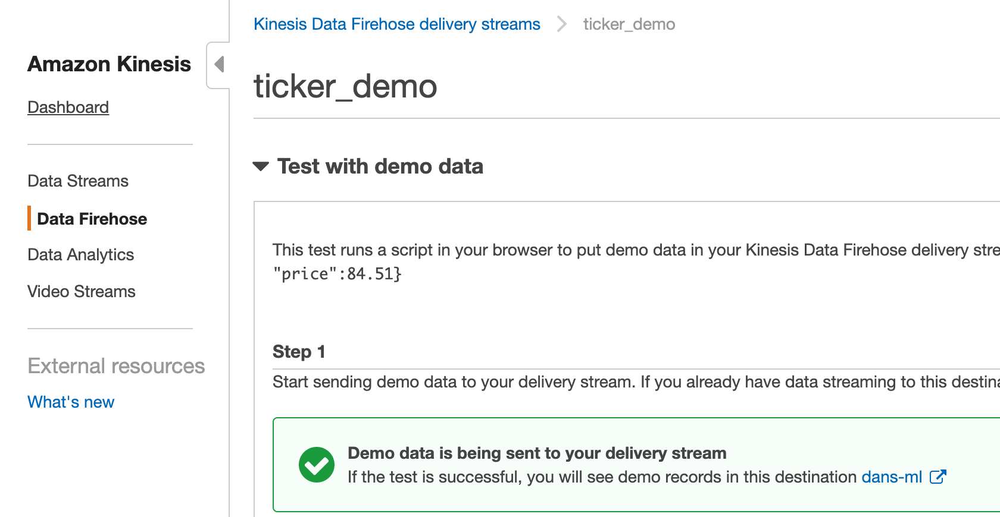
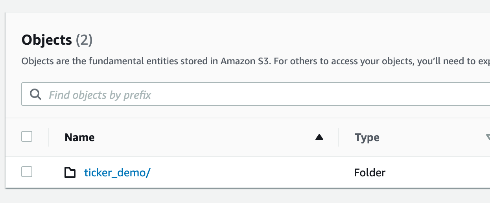
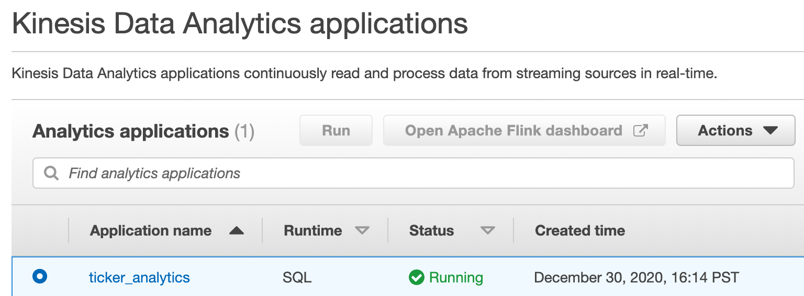
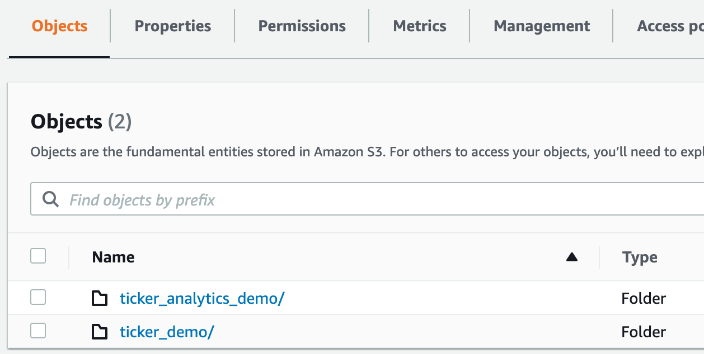
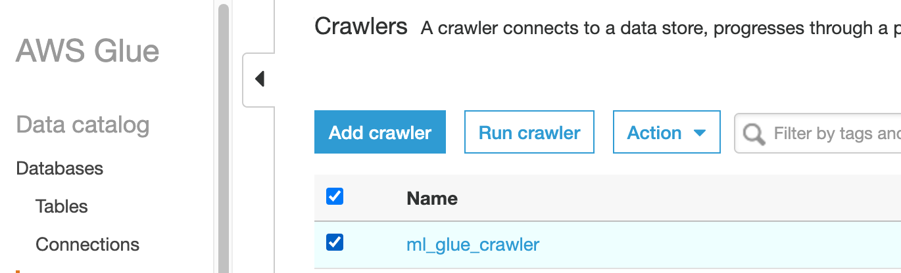

Udemy - AWS Certified ML Speciality (with Terraform)

`terraform init`
`terraform apply`

## Kinesys

Start test data stream:

After a few minutes you should see data in your bucket:

Now, start the analytics application:

After a few minutes you should see more data in your bucket:

## Glue

Kick off the crawler:

## EMR

